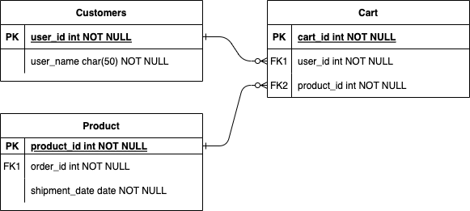

# fastapi-cart

장바구니 구현에서 두가지 프로세스로 나누어 생각해야 한다.
1. 회원 인증(로그인)을 하지 않았을 때 장바구니 (프론트에서 처리)
2. 회원 인증을 한 뒤에 장바구니 (백엔드에서 처리)

첫 번째의 경우는 쿠키와 세션을 이용하여 장바구니에 저장한다.
두 번째의 경우에는 db에 저장하여 담아놓은 장바구니의 상태를 유지시킨다.

## Schema

회원 인증을 한 뒤에 회원 id를 참조하여 장바구니 테이블에 product_id와 함께 저장한다.

[참고](https://ryulstudy.tistory.com/55)